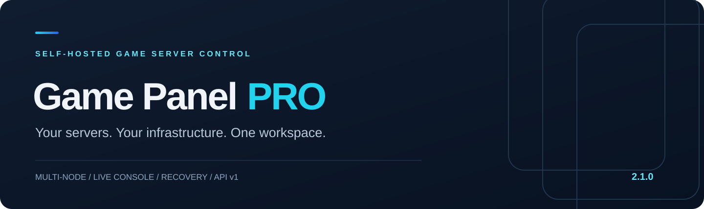
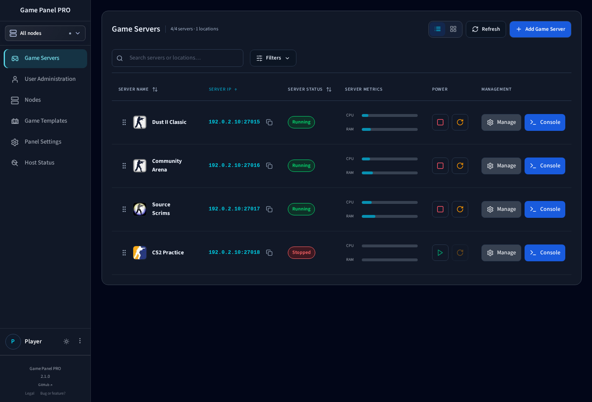

<div align="center">



[](https://github.com/Skoczi/game-panel-pro/releases)
[](https://github.com/Skoczi/game-panel-pro/actions/workflows/skoczi-ci.yml)
[](LICENSE-2.0.txt)

[Install](docs/pro/INSTALL.md) · [Documentation](docs/README.md) · [API](docs/pro/API-V1-GUIDE.en.md) · [What's new](docs/pro/RELEASE-2.1.0.md) · [Polski](docs/README.pl.md)

</div>

**Game Panel PRO** is a self-hosted control panel for running game servers across your own Linux infrastructure. Manage the fleet, work in the console, edit files, install game frameworks and recover from backups in one responsive workspace.

Built and maintained by **Skoczi**. Deploy it on your hardware, choose your runtime nodes and keep control of your game data.

## One workspace. Every server.



*Actual application UI with demonstration data. Dark and light themes, desktop and mobile layouts.*

[Light theme](docs/screenshots/fleet-light.png) · [Card view](docs/screenshots/fleet-cards.png) · [Mobile](docs/screenshots/fleet-mobile.png)

| Operate | Configure | Automate |
| :--- | :--- | :--- |
| Multi-node fleet with global server IDs | File editor, history and context actions | Scoped API v1 with an OpenAPI contract |
| Live console, command history and log search | Game configuration, maps and administrators | Native server provisioning with progress |
| CPU, memory and independent game response | Framework installation with recovery backups | Scheduled tasks and maintenance workflows |
| Start, stop and restart with clear state | Dedicated-IP SFTP and node networking | Monitoring alerts and signed webhooks |

## Made for the work between matches

**Find the right server.** Sort by IP and port, filter by node or game, switch between cards and a compact list, or keep a personal drag-and-drop order. Server pages and file locations have shareable URLs and browser history.

**See who is playing.** A2S-compatible games show player counts in cards and table rows. Authorized users can open a live, searchable roster with scores and connection times.

**Get from a log to a fix.** Search console output without losing the live stream. Open the file editor, review history and save configuration. Mobile actions stay within reach through compact toolbars and contextual menus.

**Keep access deliberate.** Give users their assigned servers. Use viewer, console-operator or server-admin presets; server-admin can manage files without gaining a terminal or CPU/IP/port controls. Operators manage the panel while the owner account stays protected. Authenticator-based 2FA and revocable sessions protect sign-in.

**Recover with context.** Native backups include validation, operation history, configurable retention and verified external copies. Restore stages files before replacement. Clone and transfer workflows review identity and network settings before creating another instance.

## Counter-Strike, with the right tools

| Game | Configuration and runtime tools |
| :--- | :--- |
| CS 1.6 / ReHLDS | Maps, rotation, AMXX administrators and plugins; ReHLDS addon catalog; separate HLTV relay template |
| Counter-Strike: Source | Native template, Metamod:Source and SourceMod management |
| CS:GO Legacy | Native template, Metamod:Source and SourceMod management |
| Counter-Strike 2 | Native template; Metamod:Source, CounterStrikeSharp, SwiftlyS2 and ModSharp management |
| Classic Offensive | Local package installation, immutable shared files and pinned Metamod/SourceMod inputs |

Source games share their Game/Query/RCON port; TV uses a separate allocation. Game assets, Steam credentials and framework compatibility are game-specific. Classic Offensive requires operator-supplied local assets; they are not distributed with this project.

The versioned template catalog also supports other games. Existing provider adapters remain available; capabilities differ by runtime. See the [compatibility matrix](docs/pro/FEATURES.md), [Source runtimes](runtime/source/README.md) and [Classic Offensive setup](runtime/classic/README.md).

## Build your integration

```bash
# Load TOKEN from your integration's secret store.
curl --fail-with-body -sS \
  'https://panel.example.com/api/v1/servers?sort=address&limit=25' \
  -H "Authorization: Bearer $TOKEN"
```

Read rich server details, plan and provision a stopped Native server, follow operations, create user accounts, assign server access and manage AMXX administrators. Writes use scoped permissions; installation, backup and power requests support idempotency.

[API guide](docs/pro/API-V1-GUIDE.en.md) · [OpenAPI](docs/pro/openapi-v1.json) · [English PDF](docs/api/game-panel-pro-api-v1-en.pdf) · [Polish PDF](docs/api/game-panel-pro-api-v1-pl.pdf)

## Install on your infrastructure

Use a supported Debian/Ubuntu host with root access, a domain and ports 80/443 available. Allow at least 6 GiB available RAM for the source build; game workloads need additional capacity.

```bash
git clone --branch v2.1.0 --depth 1 https://github.com/Skoczi/game-panel-pro.git
cd game-panel-pro
sudo bash deploy/install.sh
```

The installer builds the panel locally, configures HTTPS and creates the initial account. It refuses a non-empty installation root. Telemetry is opt-in.

**Upgrading from 2.0.x?** Use the [2.1.0 upgrade instructions](docs/pro/INSTALL.md#upgrade-to-210). Older managed updaters accept only 2.0.x, so the first upgrade to 2.1.0 must use the new release checkout. Multi-node installations need a coordinated panel and agent update.

## Documentation

- [Operator guide](docs/USER-GUIDE.md): fleet, console, files, configuration, backups and access.
- [Installation and recovery](docs/pro/INSTALL.md): new hosts, upgrades and rollback.
- [Node deployment](docs/pro/DEPLOYMENT.md): agents, networking and shared dependencies.
- [API v1](docs/pro/API-V1-GUIDE.en.md): authentication, provisioning, accounts and game admins.
- [Development](docs/pro/DEVELOPMENT.md): builds, tests and contribution workflow.
- [2.1.0 release notes](docs/pro/RELEASE-2.1.0.md): changes, compatibility and validation status.

## Contribute

Report reproducible bugs or propose focused changes through [GitHub Issues](https://github.com/Skoczi/game-panel-pro/issues). Read [CONTRIBUTING.md](CONTRIBUTING.md) before submitting a pull request. Keep credentials, runtime databases and private game files out of reports.

## License

Apache License 2.0. Copyright and third-party attribution are preserved in [LICENSE](LICENSE), [LICENSE-2.0.txt](LICENSE-2.0.txt) and [NOTICE](NOTICE).
