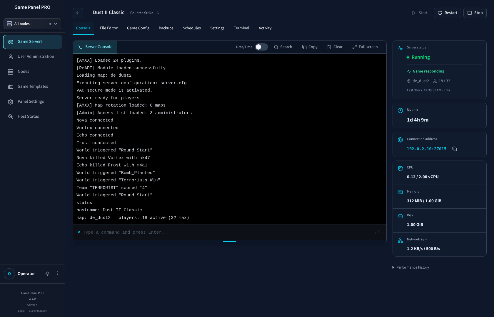
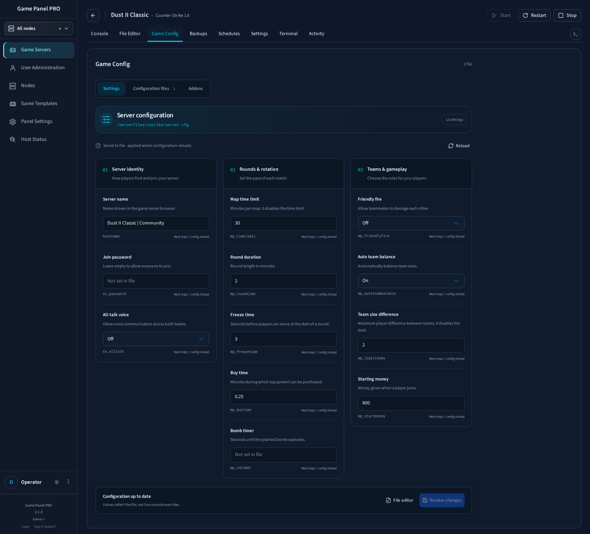
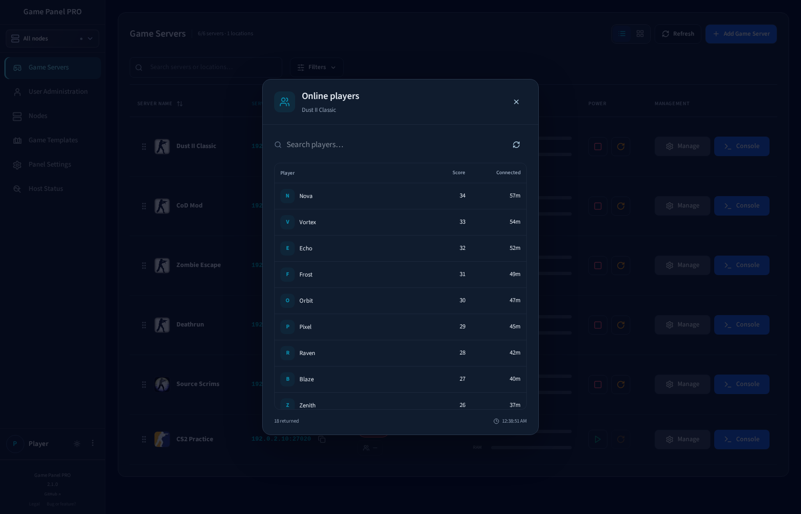
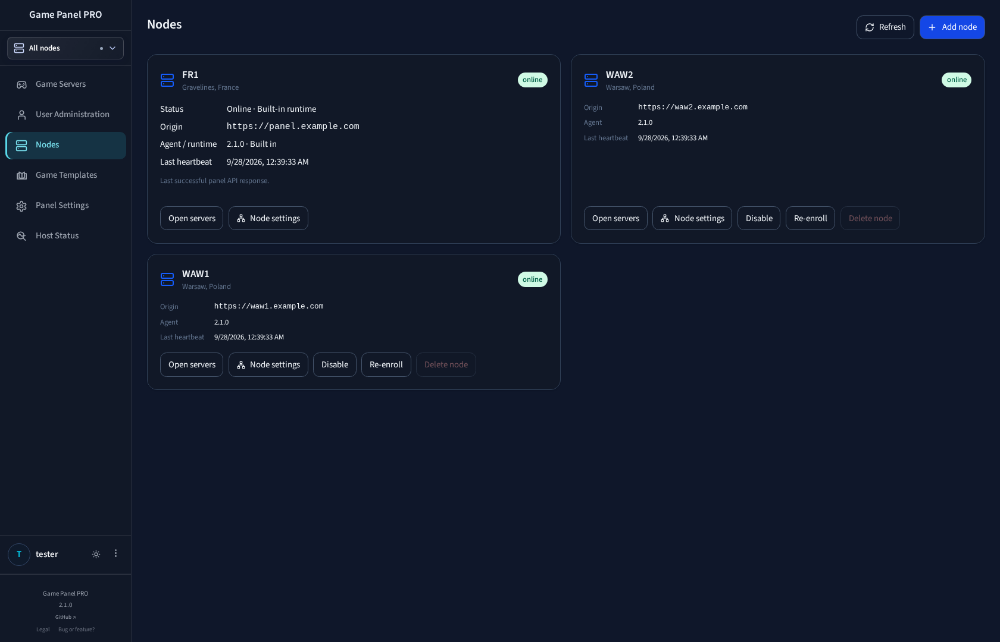
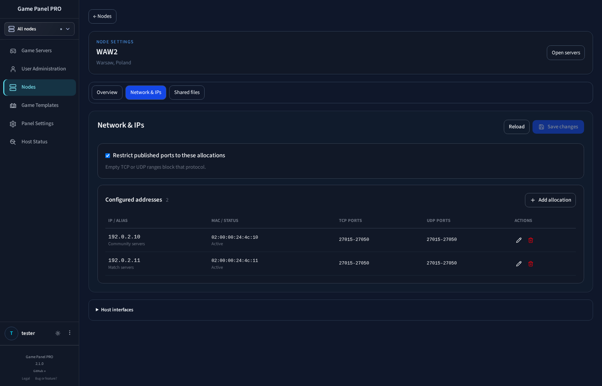
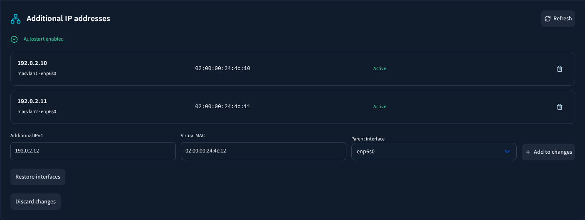

# Game Panel PRO screenshots

Actual application components with demonstration data. Addresses, player names, counts and logs are examples.

## Server fleet


[Light theme](screenshots/fleet-light.png) · [Cards](screenshots/fleet-cards.png) · [Mobile](screenshots/fleet-mobile.png)

## Console



## Configuration forms



## Online players



## Nodes



## Network allocations



## Additional IP addresses



## Reproduce

Build the backend, start the frontend Vite server on `127.0.0.1:4178`, then run:

```sh
node scripts/capture-documentation.mjs
node scripts/capture-workspaces.mjs
```

The scripts use local browser fixtures and intercept API requests; they do not connect to production.
