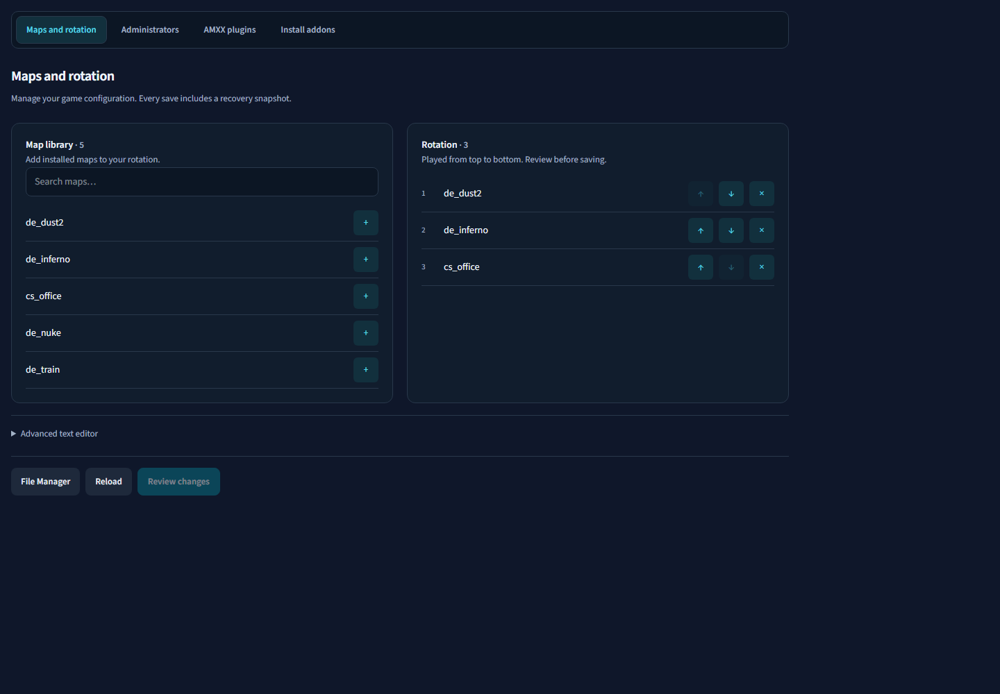
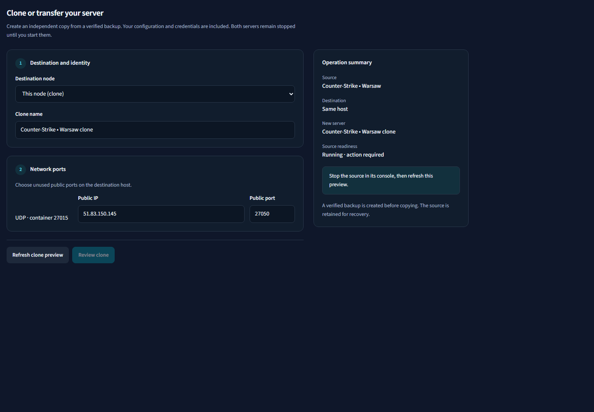
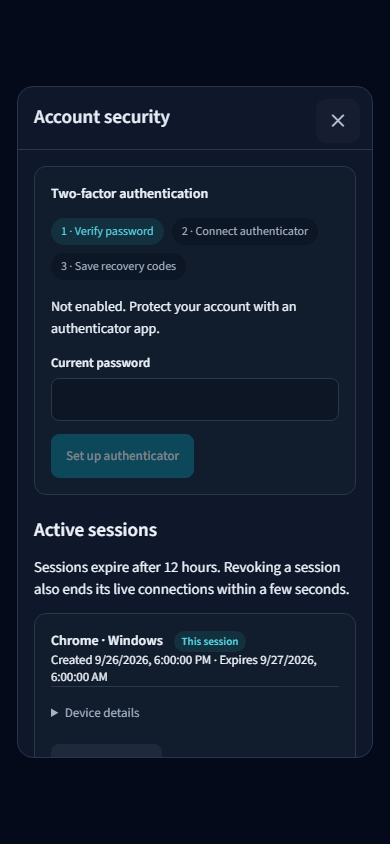

# Premium UX — wdrożenie 26.09.2026

## Zakres wykonany

1. **Wspólny wygląd:** tokeny powierzchni, tekstu, akcentu i obramowań; formularze i komunikaty; kontrolki 40 px, 44 px dla nowych mobilnych workflow; jednoznaczne aktywne sekcje i spokojniejsza nawigacja boczna. Wprowadzono `premium-workflows.css`, obok istniejących komponentów App UI/ODS.
2. **Konsola:** poprawiony wcześniej selektor obszaru logów, uporządkowany toolbar, wysokości pól, kompaktowe metryki. Test geometrii wykrywa ponowne rozciągnięcie filtrów. Needs attention pozostaje wyłącznie w Host Status.
3. **Konto:** modal dopasowany do viewportu bez ograniczenia ODS do 512 px; kroki 2FA; nazwy przeglądarki i urządzenia, oznaczenie bieżącej sesji, surowe dane w szczegółach. Zachowano QR generowany lokalnie, link do aplikacji, ręczny klucz i wymóg zapisania kodów odzyskiwania.
4. **Konfiguracja gry:** biblioteka map z wyszukiwaniem; dodawanie, usuwanie i zmiana kolejności rotacji dostępne klawiaturą; przełączniki AMXX; formularz dodawania administratorów Steam i lista usuwania ze szkicu. Nietypowe wpisy i komentarze zachowane, edycja tekstowa w trybie zaawansowanym. Zapis nadal wymaga przeglądu i wersji pliku oraz tworzy snapshot. Katalog dodatków korzysta ze wspólnych kart i kontrolek. Odrzucanie szkicu i wybór poprzedniej wersji używają modala panelu.
5. **Klonowanie/transfer:** sekcje celu, nazwy i portów; podsumowanie źródła, celu i gotowości; przegląd przed wykonaniem. Odświeżenie stanu nie usuwa wpisanej nazwy ani portów. Na mobile formularz jest pierwszy, podsumowanie poniżej. Klonowanie przeniesione z wewnętrznych zakładek do osobnej akcji nagłówka konfiguracji.
6. **Pozostałe ekrany:** wspólna wysokość App UI obejmuje istniejące strony; ujednolicono nowe ustawienia Discord, podpisanych webhooków i ochrony kopii. Przejrzano zrzuty istniejących ustawień serwera, kopii, harmonogramów, listy serwerów, węzłów i logowania. Zachowano dotychczasowe dopracowane układy tych ekranów zamiast niepotrzebnie zmieniać ich logikę.

## Weryfikacja

- Pełny pierwszy przebieg: 247/248 UI; wykryta regresja szerokości selecta filtrów naprawiona.
- Ponowny przebieg zmienionych obszarów: 82/82 UI.
- Po końcowej poprawce wysokości modala: 10/10 (konta i nowe workflow).
- Build TypeScript/Vite: OK; istniejące ostrzeżenie o dużym pakiecie Monaco.
- Macierz zrzutów: dark/light, szerokości 390, 1440, 1920 px; mapy, klonowanie i konto. Zrzuty obejrzane, poprawiono na ich podstawie kontrast stanów, konflikty stylów, szerokość i wysokość modala oraz kolejność treści mobilnej.
- Nowe testy sprawdzają zachowanie komentarzy i innych formatów uprawnień, pluginów i wpisów administratorów, przegląd przed zapisem oraz zachowanie szkicu przy konflikcie wersji.
- Kontrast par tokenów: tekst jasny 15.46:1, drugorzędny 6.31:1; ciemny 15.19:1 i 7.87:1; główny przycisk 4.77:1; aktywna ciemna zakładka 8.12:1. To obliczenia tokenów, nie certyfikacja całej strony.

## Granice odbioru

Testy przeglądarkowe używają Chromium i izolowanych fixture danych. Nie wykonano testu na fizycznym iPhonie/Safari ani pełnego audytu WCAG/zoom 200%. Otwarta wcześniej zalogowana karta eserv.pl nie była już dostępna w przeglądarce narzędziowej. Żadne testy UI nie instalują dodatków, nie zmieniają kont ani nie uruchamiają operacji na rzeczywistym serwerze gry.

## Przykładowe zrzuty

### Mapy — desktop

### Klonowanie — desktop

### Bezpieczeństwo konta — mobile

## Wdrożenie FR1

Frontend live: `2a8e8e0ff8c243dec381f3e1a39ec71a5df7b704`, obraz `gamepanel-pro-frontend:local-20260926-premium-2a8e8e0`. Sprawdzono nginx, trasy aplikacji i nagłówki na origin. Helper potwierdził niezmienione pozostałe kontenery FR1. Rollback: `/opt/gamepanel-pro/local-patches/20260926-premium-2a8e8e0/rollback`. Publiczna strona eserv.pl otwiera poprawny formularz logowania w przeglądarce; brak aktywnej sesji uniemożliwił odbiór zalogowanego panelu live.
